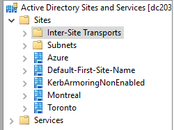
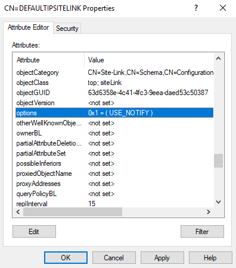
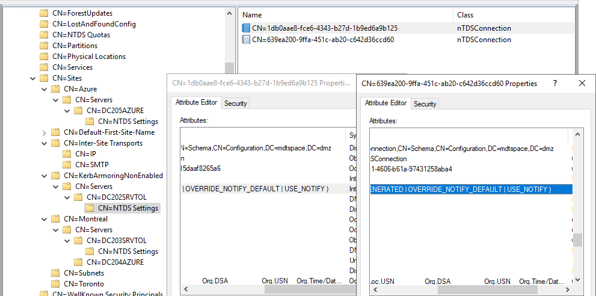

# Change the default replication interval to instant
By default your intersite replication is to 15 min. For example, considering you have 2 sites (On-Prem and Azure), you have to wait 15 min to have your modification done in Azure.
This can lead to business issues (users have to wait 15 min) or security issues (accounts will be disabled after 15 min).



## Automatically
Via PowerShell
```
$NamingContext = (Get-ADRootDSE).configurationNamingContext
Get-ADObject -LDAPFilter "(objectCategory=sitelink)" –Searchbase $NamingContext -Properties options | ForEach-Object { 
    Set-ADObject $_ –replace @{ options = $($_.options -bor 1) }
}
```

Via GUI




## Validate
Be sure you have "USE_NOTIFY".




# Disclaimer
See [DISCLAIMER](./DISCLAIMER.md).